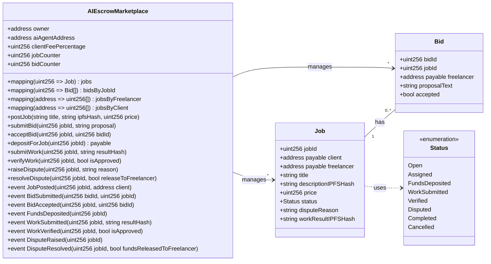
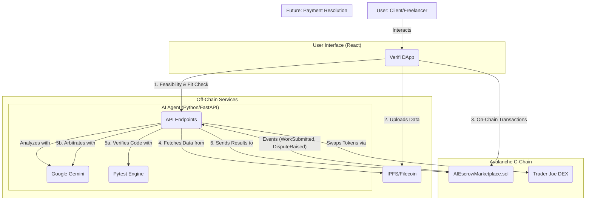
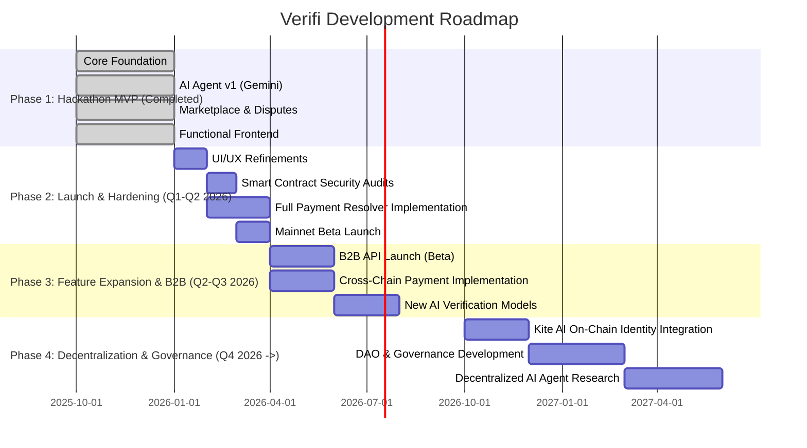

### 1. Updated UML Diagrams

Based on the code analysis, here are the updated diagrams reflecting the actual implementation in your application.

#### **Class Diagram**

This diagram is updated to accurately reflect the variables, functions, and events present in your `AIEscrowMarketplace.sol` smart contract, including details like the `clientFeePercentage`.

#### **System Architecture Diagram**

This diagram is updated to explicitly show the integration with **Google Gemini** and the code verification flow using **Pytest**.

### 2. New Development Roadmap Diagram

Here is a new development roadmap in a Gantt chart format. It visualizes the project's phases from the completed MVP to full decentralization in the future.

