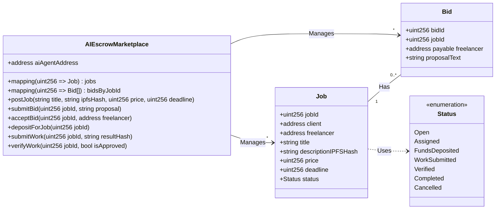
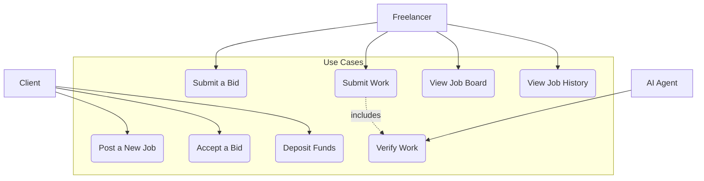
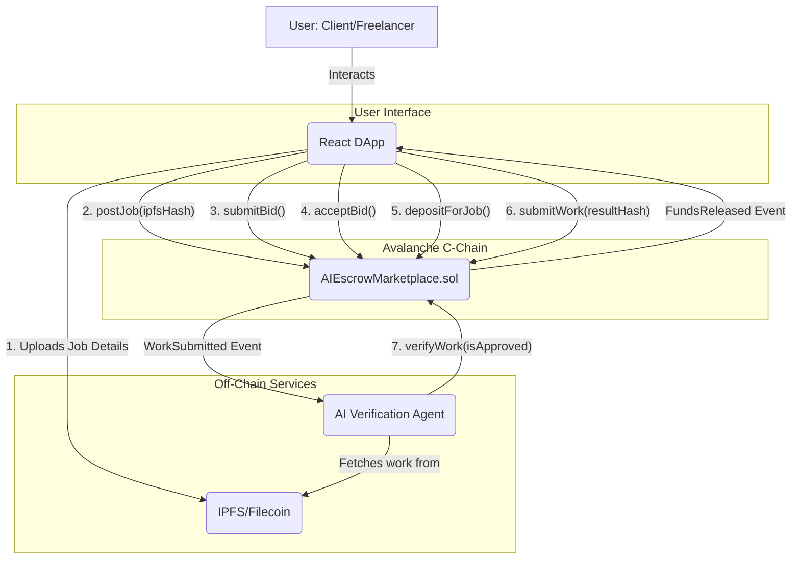
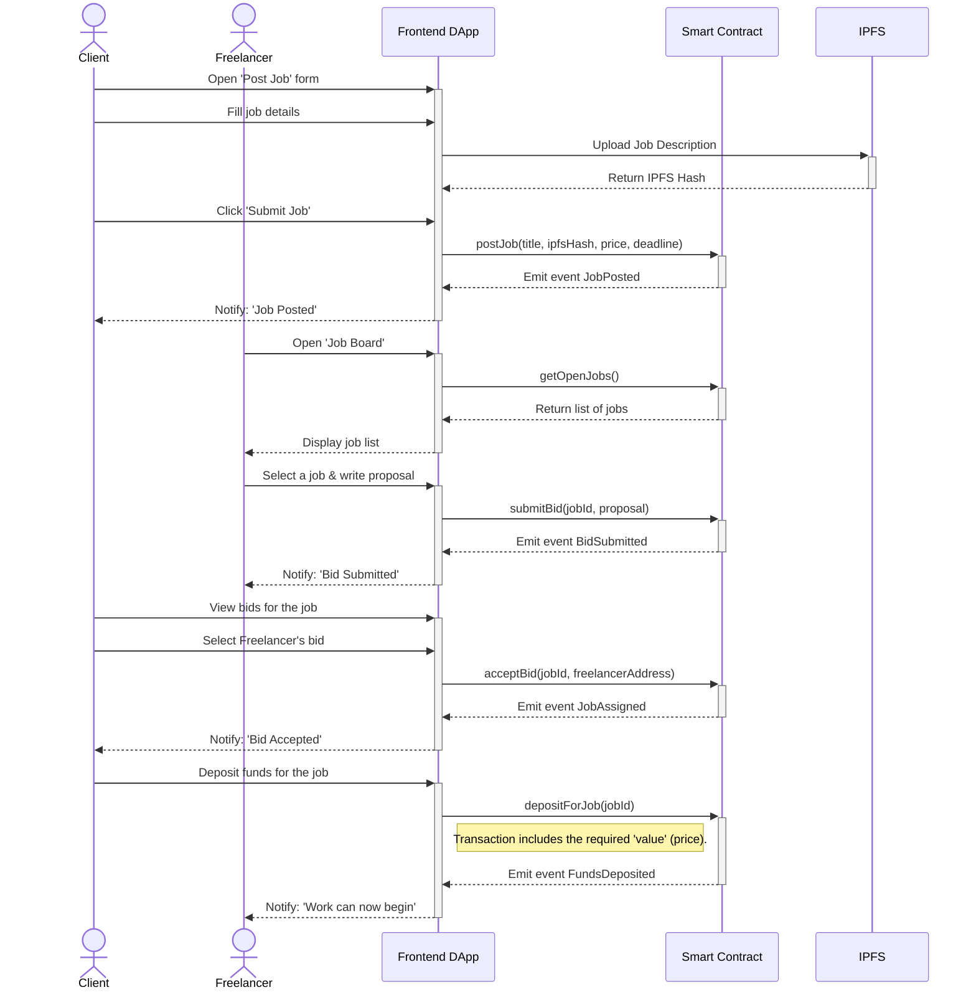

# Development Plan: AI Escrow Marketplace v2

## 1. Introduction

This document details the technical design for evolving the AI Escrow Marketplace prototype from a simple escrow mechanism into a functional freelance platform with a marketplace, bidding process, and separate dashboards for Clients and Freelancers.

## 2. Current State Analysis

- **Smart Contract:** Only supports a pre-arranged 1-to-1 workflow. Lacks functionality for public job postings or a bidding process. The `Job` data structure is minimal.
- **AI Agent:** Verification logic is still basic and not integrated with complex job details.
- **Frontend:** Existing UI components are basic, reflecting the simple smart contract functions. There is no logical separation between the Client and Freelancer dashboards, and it lacks many of the required input fields and data displays.

## 3. Proposed Architecture & Changes

### 3.1. Smart Contract Changes (`AIEscrowMarketplace.sol`)

To support marketplace functionality, the data structures and workflow will be fundamentally changed.

**New Data Structures:**

```solidity
// Updated job statuses
enum Status {
    Open,           // Job posted, open for bidding
    Assigned,       // Freelancer selected, awaiting deposit
    FundsDeposited, // Client has deposited, work can begin
    WorkSubmitted,  // Freelancer has submitted the work
    Verified,       // AI Agent has completed verification
    Completed,      // Funds have been released
    Cancelled       // Cancelled
}

struct Job {
    uint256 jobId;
    address payable client;
    address payable freelancer; // Filled after a bid is accepted
    string title;
    string descriptionIPFSHash; // Hash of detailed description, requirements, etc.
    uint256 price;
    uint256 deadline; // Unix timestamp
    Status status;
}

struct Bid {
    uint256 bidId;
    uint256 jobId;
    address payable freelancer;
    string proposalText; // Freelancer's offer description
}

// New Mappings
mapping(uint256 => Job) public jobs;
mapping(uint256 => Bid[]) public bidsByJobId;
mapping(address => uint256[]) public jobsByFreelancer;
mapping(address => uint256[]) public jobsByClient;
```

**New Workflow & Functions:**

**Class Diagram:**



1.  `postJob(string memory _title, ...)`: Called by the **Client** to create a new job available for bidding. Job status will be `Open`.
2.  `submitBid(uint256 _jobId, ...)`: Called by the **Freelancer** to place a bid on an `Open` job.
3.  `acceptBid(uint256 _jobId, ...)`: Called by the **Client** to select a winning bid. This sets the `job.freelancer` and changes the job status to `Assigned`.
4.  `depositForJob(uint256 _jobId)`: Replaces `depositFunds`. The client deposits funds after a bid is accepted. Status changes to `FundsDeposited`.
5.  `submitWork`, `verifyWork`, and `_releaseFunds` functions will remain, with minor modifications to fit the new workflow.

### 3.2. AI Agent Changes

- The AI Agent's logic will not change significantly. It will continue to listen for the `WorkSubmitted` event.
- The agent can now fetch richer job details (like `descriptionIPFSHash`) from the smart contract to perform more contextual verification if needed in the future.

### 3.3. Frontend Design (React)

The dashboard will be logically separated after the user connects their wallet. The application will detect the user's role (e.g., as a client or freelancer on a job).

**New Components:**

- **Core Components:**
    - `ConnectWalletButton.tsx`: A button to connect a wallet (e.g., MetaMask).
    - `RoleBasedDashboard.tsx`: The main component that will render either the Client or Freelancer dashboard.

- **Client-Side Components:**
    - `JobPostingForm.tsx`: A new form for `postJob` with fields: `Title`, `Description` (textarea), `Requirements File` (upload to IPFS), `Price`, `Deadline`.
    - `MyPostedJobs.tsx`: A list of jobs posted by the client, showing status (`Open`, `Assigned`, `Completed`) and bid counts.
    - `ViewBids.tsx`: A view to see all freelancers who have bid on a specific job, complete with an `Accept Bid` button.

- **Freelancer-Side Components:**
    - `JobBoard.tsx`: The main view for freelancers, containing a list of all jobs with `Open` status. Will include `Search` and `Filter` features.
    - `JobDetailModal.tsx`: A modal that appears when a freelancer clicks a job on the `JobBoard`, showing full details and the form to `submitBid`.
    - `MyBidsList.tsx`: A list of bids submitted by the freelancer.
    - `ActiveJobs.tsx`: A list of jobs the freelancer is currently working on.
    - `JobHistory.tsx`: An archive of completed jobs.

**State Management:**
- **Zustand** or **React Context** is recommended for managing global state such as:
    - Wallet connection info (address, chainId).
    - Job data fetched from the smart contract.
    - Loading and error statuses.

## 4. UML Diagrams

### 4.1. Use Case Diagram

This diagram shows the main interactions between actors (Client, Freelancer, AI Agent) and the system.



### 4.2. System Architecture Diagram (Updated)

This diagram illustrates the main system components and how they interact in the new architecture.



### 4.3. Sequence Diagram: Job Posting to Work Start Workflow

This diagram details the sequence of interactions for the workflow from a client posting a job until a freelancer starts the work.



## 5. Technology & Integration
- **Frontend:** React (fully responsive Web app), Vite, Ethers.js (or Viem) for blockchain interaction.
- **Styling:** Chakra UI or TailwindCSS for rapid UI development.
- **Off-chain Storage:** IPFS (via `web3.storage` or Pinata) for storing job description files and work results.
