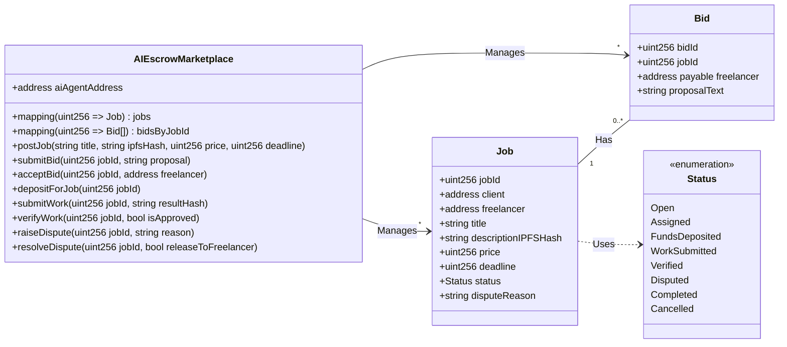
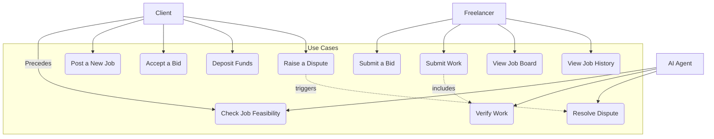
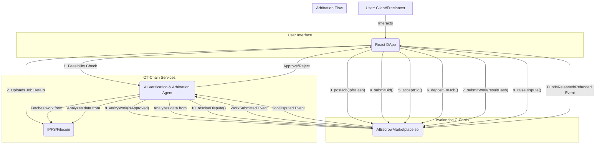
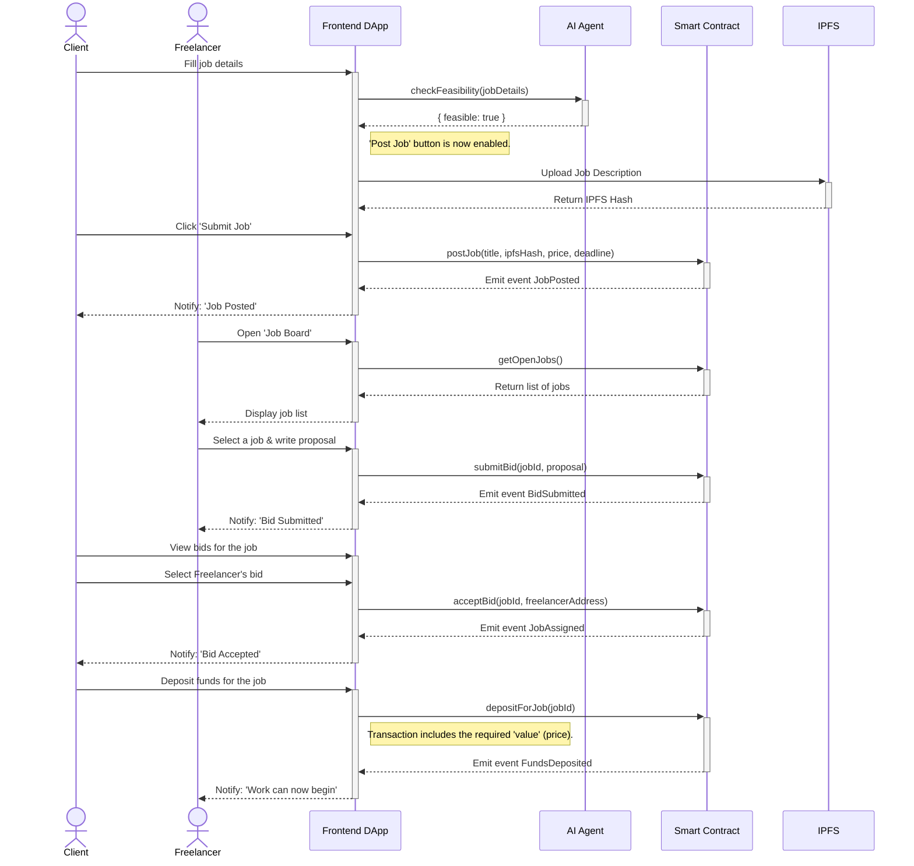
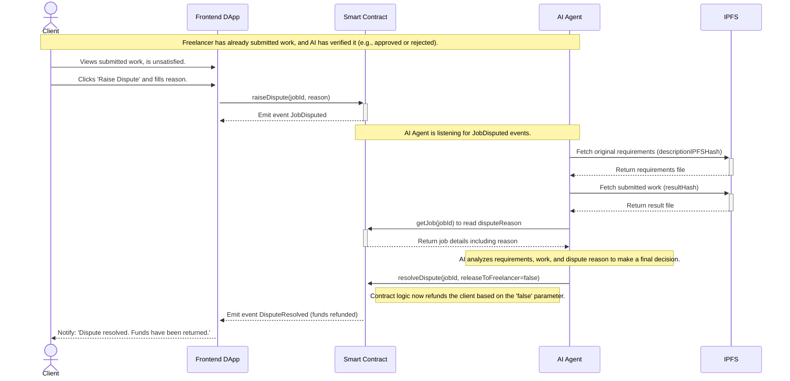

# Development Plan: AI Escrow Marketplace v2

## 1. Introduction

This document details the technical design for evolving the AI Escrow Marketplace prototype from a simple escrow mechanism into a functional freelance platform with a marketplace, bidding process, and separate dashboards for Clients and Freelancers.

## 2. Current State Analysis

- **Smart Contract:** Only supports a pre-arranged 1-to-1 workflow. Lacks functionality for public job postings or a bidding process. The `Job` data structure is minimal.
- **AI Agent:** Verification logic is still basic and not integrated with complex job details. It only acts after work is submitted.
- **Frontend:** Existing UI components are basic, reflecting the simple smart contract functions. There is no logical separation between the Client and Freelancer dashboards, and it lacks many of the required input fields and data displays.

## 3. Proposed Architecture & Changes

### 3.1. Smart Contract Changes (`AIEscrowMarketplace.sol`)

To support marketplace functionality, the data structures and workflow will be fundamentally changed.

**New Data Structures:**

```solidity
// Updated job statuses
enum Status {
    Open,           // Job posted, open for bidding
    Assigned,       // Freelancer selected, awaiting deposit
    FundsDeposited, // Client has deposited, work can begin
    WorkSubmitted,  // Freelancer has submitted the work
    Verified,       // AI Agent has completed verification
    Disputed,       // Client disputes the work/verification
    Completed,      // Funds have been released
    Cancelled       // Cancelled
}

struct Job {
    uint256 jobId;
    address payable client;
    address payable freelancer; // Filled after a bid is accepted
    string title;
    string descriptionIPFSHash; // Hash of detailed description, requirements, etc.
    uint256 price;
    uint256 deadline; // Unix timestamp
    Status status;
    string disputeReason; // Reason for dispute
}

struct Bid {
    uint256 bidId;
    uint256 jobId;
    address payable freelancer;
    string proposalText; // Freelancer's offer description
}

// New Mappings
mapping(uint256 => Job) public jobs;
mapping(uint256 => Bid[]) public bidsByJobId;
mapping(address => uint256[]) public jobsByFreelancer;
mapping(address => uint256[]) public jobsByClient;
```

**New Workflow & Functions:**

**Class Diagram:**



1.  `postJob(string memory _title, ...)`: Called by the **Client** to create a new job. This action is only enabled after an off-chain feasibility check by the AI Agent. Job status will be `Open`.
2.  `submitBid(uint256 _jobId, ...)`: Called by the **Freelancer** to place a bid on an `Open` job.
3.  `acceptBid(uint256 _jobId, ...)`: Called by the **Client** to select a winning bid. This sets `job.freelancer` and changes status to `Assigned`.
4.  `depositForJob(uint256 _jobId)`: Replaces `depositFunds`. The client deposits funds after a bid is accepted. Status changes to `FundsDeposited`.
5.  `submitWork`, `verifyWork`, and `_releaseFunds` functions will remain, with modifications.
6.  **`raiseDispute(uint256 _jobId, string memory _reason)`**: Called by the **Client** if they disagree with the submitted work, even after AI verification. This changes the status to `Disputed`.
7.  **`resolveDispute(uint256 _jobId, bool _releaseToFreelancer)`**: Called only by the **AI Agent** (or a future DAO) to finalize arbitration. It releases funds to the freelancer or returns them to the client.

### 3.2. AI Agent Changes

The role of the AI Agent is significantly expanded to act as a gatekeeper, verifier, and arbiter. The AI Agent will leverage **Gemini AI for Large Language Model (LLM) processing** in data analysis and decision-making, and will also consider future collaboration with **Kite AI** for enhanced trust and architecture.

#### 3.2.1. Phase 1: Job Feasibility Verification (Pre-Posting)

Before a client can post a job to the smart contract, the frontend will first send the job details (title, description, requirements) to the AI Agent via an off-chain API call. The AI will perform a feasibility check based on:
- **Clarity & Completeness**: Are the requirements clear, specific, and measurable?
- **Feasibility**: Is the requested work technically possible within the given constraints?
- **Platform Policy**: Does the job violate any platform rules (e.g., illegal activities, spam)?
- **Scam Detection**: Does the job show signs of being a potential scam?

Only if the AI Agent returns a positive "feasibility score" will the frontend allow the client to proceed with the `postJob` transaction. This prevents gas wastage on poorly defined or malicious jobs.

**AI Agent Backend Implementation Details (Feasibility Check):**
*   **Endpoint:** A new API endpoint (e.g., `/check-job-feasibility`) will be created in the AI Agent backend (likely Python/FastAPI).
*   **Input:** This endpoint will receive job details (title, description, requirements) from the frontend.
*   **Logic:**
    *   Utilize **Gemini AI (LLM)** to process the job's title, description, and requirements text.
    *   Implement logic to analyze the input for clarity, completeness, technical feasibility, policy violations, and scam detection. This would involve NLP models, rule-based systems, or external API calls.
    *   Return a boolean result (`feasible: true/false`) and a reason if not feasible.
*   **Frontend Integration (`JobPostingForm.tsx`):**
    *   Add a `useEffect` hook that triggers an off-chain API call to the AI Agent's `/check-job-feasibility` endpoint whenever `title`, `description`, or `requirements` change.
    *   Display a loading indicator while checking feasibility.
    *   Based on the AI Agent's response: enable/disable the "Post Job" button and display a clear message (e.g., "AI says job is feasible!" or "AI found issues: [reason]. Please revise.").

#### 3.2.2. Phase 2: Work Result Verification & Arbitration (Post-Submission)

1.  **Verification**: This process remains the same. The agent listens for the `WorkSubmitted` event, fetches the job requirements and the submitted work from IPFS, and runs its verification logic. It then calls `verifyWork(jobId, isApproved)`.
    *   **AI Agent Backend Implementation Details (Verification):**
        *   **Event Listener:** The AI Agent will listen for `WorkSubmitted` events from the smart contract.
        *   **Data Retrieval:** Fetch original job requirements and submitted work from IPFS.
        *   **Verification Logic:** Run existing (or enhanced) verification logic, potentially using **Gemini AI (LLM)** to compare submitted work against requirements (especially for text-based deliverables or summaries).
        *   **Smart Contract Interaction:** Call `verifyWork(jobId, isApproved)` on the smart contract.
    *   **UI Impact (Client - `MyPostedJobs.tsx`, Freelancer - `ActiveJobs.tsx`/`JobHistory.tsx`):**
        *   Job status updates (e.g., `WorkSubmitted` to `Verified` or `Cancelled`).
        *   Display of AI verification reports (e.g., "AI Verified: 98% match to requirements").

2.  **Arbitration (In Case of Conflict)**: If a client is unsatisfied with the work and initiates a dispute by calling `raiseDispute`, the following occurs:
    - The smart contract status changes to `Disputed`.
    - The AI Agent is notified (e.g., by listening to a `JobDisputed` event or via an off-chain API call).
    - The AI Agent acts as an **impartial arbiter**. It analyzes:
        - The original job requirements (`descriptionIPFSHash`).
        - The freelancer's submitted work (`resultHash`).
        - The client's reason for the dispute (`disputeReason`).
    - Based on this three-way analysis, the AI determines the outcome (e.g., work is satisfactory, work needs revision, work is unsatisfactory).
    - The AI Agent then calls `resolveDispute(jobId, releaseToFreelancer)` on the smart contract to execute the final decision, either releasing the funds to the freelancer or refunding the client.

    **AI Agent Backend Implementation Details (Arbitration):**
    *   **Event Listener:** The AI Agent will listen for a new smart contract event, `JobDisputed` (which needs to be added to the contract).
    *   **Data Retrieval:** When `JobDisputed` is emitted, the agent will:
        *   Fetch original job requirements from IPFS (`descriptionIPFSHash`).
        *   Fetch submitted work from IPFS (`resultIPFSHash`).
        *   Retrieve the `disputeReason` from the smart contract.
    *   **Arbitration Logic:** Implement AI logic to analyze these three pieces of information and determine the dispute outcome. This would be a more complex decision-making process, leveraging **Gemini AI (LLM)** for analyzing textual data (requirements, dispute reason, work summaries) and generating a rationale for the decision.
    *   **Smart Contract Interaction:** Based on the arbitration decision, the AI Agent will call the `resolveDispute(jobId, releaseToFreelancer)` function on the smart contract.
    **UI Impact (Client - `MyPostedJobs.tsx`/`DisputeForm.tsx`, Freelancer - `ActiveJobs.tsx`/`JobHistory.tsx`):**
        *   Job status updates (e.g., `Disputed`, `Completed`, `Cancelled`).
        *   Display of AI arbitration decision and reason.
        *   `DisputeForm.tsx` (new component): A modal form where the client inputs their `disputeReason` and calls `raiseDispute` on the smart contract.

#### 3.2.3. Considerations for Kite AI Integration/Adoption

While the AI Agent is currently implemented as an off-chain service, concepts from the Kite AI platform can provide valuable guidance for future evolution and enhancement:

*   **AI Agent Identity and Authentication:** Adopting cryptographic identity models from Kite AI could enable each AI Agent (or module within our agent) to have an on-chain verifiable identity. This would enhance the transparency and auditability of all decisions made by the AI Agent, especially in job feasibility verification and arbitration phases.
*   **Decision Governance:** Kite AI's detailed governance principles can be applied to define and enforce rules on how the AI Agent makes verification and arbitration decisions. This could involve a programmable set of rules governing parameters, constraints, and criteria used by the AI Agent.
*   **Stronger Verification Results:** With Kite AI's verification framework, we can explore ways to cryptographically prove the integrity and provenance of the AI Agent's verification results. This would build greater trust in the AI Agent's decisions, reducing the potential for further disputes.
*   **Agent-Oriented Planning (AOP):** Adopting an AOP approach supported by Kite AI can help in designing more modular, autonomous, and effectively collaborative AI Agents. This would be highly relevant if, in the future, we have multiple AI Agents handling various aspects of the marketplace (e.g., one for feasibility verification, one for result verification, one for arbitration, etc.).

Direct integration with Kite AI's Layer 1 blockchain might be a future evolutionary step. However, adopting its design philosophy and core functionalities can significantly strengthen the trust, transparency, and capabilities of our AI Agent.

#### 3.2.4. Adopting Kite AI for Agentic Workflows

To evolve the AI Agent towards more robust, verifiable, and autonomous agentic workflows, the following steps will be integrated, leveraging Kite AI's principles and potential future integrations:

1.  **Modularization of AI Agent Components (Agent-Oriented Planning):**
    *   **Action:** Refactor the existing (or planned) monolithic AI Agent backend into distinct, specialized sub-agents.
    *   **Details:**
        *   **Feasibility Agent:** Dedicated to pre-posting job checks.
        *   **Verification Agent:** Dedicated to post-submission work verification.
        *   **Arbitration Agent:** Dedicated to dispute resolution.
    *   **Benefit:** Enhances modularity, autonomy, and scalability as per Agent-Oriented Planning (AOP) principles, aligning with Kite AI's philosophy.

2.  **Establish On-Chain Agent Identity & Authentication:**
    *   **Action:** Implement on-chain identities for each modular AI Agent component within the Kite AI ecosystem (or a compatible blockchain using Kite AI's design patterns).
    *   **Details:** Each agent will have a unique, verifiable identity. Decisions made by these agents will be digitally signed and associated with their on-chain identity.
    *   **Benefit:** Enhances transparency, auditability, and trust in AI-driven decisions, crucial for a B2B system.

3.  **Implement Verifiable Decision Governance:**
    *   **Action:** Define and integrate a governance mechanism for the AI Agent's decision-making logic.
    *   **Details:** Decision rules, parameters, and criteria for feasibility scoring, work verification, and arbitration will be transparently recorded and potentially governed on-chain (e.g., through smart contracts that hold the current rule set).
    *   **Benefit:** Ensures that AI decisions are predictable, fair, and auditable, reducing biases and increasing confidence.

4.  **Cryptographic Attestation of Verification Results:**
    *   **Action:** Explore and implement mechanisms to cryptographically attest to the integrity and provenance of AI Agent verification results.
    *   **Details:** When an AI Agent calls `verifyWork` or `resolveDispute`, it will include a cryptographic proof (e.g., a hash of its input data and decision logic, signed by its on-chain identity) that can be verified by external parties.
    *   **Benefit:** Builds greater trust in the AI Agent's decisions, making them tamper-proof and auditable, aligning with Kite AI's verification framework.

5.  **Agent Coordination Mechanism:**
    *   **Action:** Design and implement a coordination layer (off-chain or on-chain) for the modular AI Agents.
    *   **Details:** This layer will orchestrate the flow between Feasibility Agent (pre-posting) -> Contract (postJob) -> Verification Agent (post-submission) -> Contract (verifyWork) -> Arbitration Agent (if dispute).
    *   **Benefit:** Ensures seamless autonomous execution of agentic workflows.

6.  **Future Consideration: Direct Kite AI Layer 1 Integration:**
    *   **Action:** Continuously monitor the development of Kite AI's Layer 1 blockchain for opportunities for direct integration, particularly for on-chain identity management, verifiable computation, and enhanced decision governance.
    *   **Benefit:** Leverage Kite AI's native capabilities for maximum security, transparency, and agent autonomy.

#### 3.2.4. Concept: AI Agent as a B2B System

The AI Agent, at its core, can be envisioned as a powerful B2B service, extending the platform's utility beyond individual freelancers and clients. This system could serve various business models:

1.  **Platform-as-a-Service (PaaS) for Enterprises:**
    *   The entire `AIEscrowMarketplace` (smart contract, AI agent, and frontend) could be offered as a white-label or API-driven solution to larger enterprises. These enterprises could use it to manage their own pool of contract workers (internal or external), ensuring automated verification and transparent payments for complex projects.
    *   **Use Cases:** Large corporations outsourcing development, marketing agencies managing content creation, R&D departments collaborating with external research teams.

2.  **AI Verification as a Standalone B2B Offering:**
    *   The AI Agent's core verification capability (Feasibility Check, Work Result Verification, Arbitration) could be exposed as a dedicated API service. Other B2B platforms or companies with existing internal workflows could integrate this AI verification service to:
        *   **Automate Quality Assurance:** For outsourced tasks (e.g., content moderation, data entry, software testing).
        *   **Streamline Contract Compliance:** Verify deliverables against predefined contract terms and KPIs.
        *   **Enhance Trust:** Provide an unbiased, auditable verification layer for critical business processes involving external parties.
    *   **Configurable AI Models:** For B2B applications, AI agents would be highly specialized and configurable to specific industry standards, compliance requirements, or unique project types (e.g., AI for verifying technical specifications, legal document summarization, specific data analysis reports).

3.  **Dispute Resolution as a Service:**
    *   The AI Agent's arbitration module could be offered as a neutral, automated dispute resolution service for other platforms or contract agreements. This provides a scalable and objective mechanism for resolving disagreements before escalating to costly human arbitration.

**Benefits for B2B Integration:**
*   **Increased Efficiency:** Automate time-consuming verification processes.
*   **Reduced Costs:** Minimize manual QA and dispute resolution overhead.
*   **Enhanced Trust & Transparency:** Provide verifiable and objective assessments of work.
*   **Scalability:** Easily manage larger volumes of projects and external collaborations.
*   **Risk Mitigation:** Reduce the risk of project delays, poor quality deliverables, and payment disputes.

### 3.4. Frontend Design (React)

The dashboard will be logically separated after the user connects their wallet. The application will detect the user's role.

**New Components:**

- **Core Components:**
    - `ConnectWalletButton.tsx`: A button to connect a wallet.
    - `RoleBasedDashboard.tsx`: Renders either the Client or Freelancer dashboard.

- **Client-Side Components:**
    - `JobPostingForm.tsx`: Form for `postJob`. The "Submit" button is disabled until the AI feasibility check passes.
    - `MyPostedJobs.tsx`: List of client's jobs, showing status and bid counts.
    - `ViewBids.tsx`: View all bids for a job, with an `Accept Bid` button.
    - `DisputeForm.tsx`: A new modal form for a client to submit a `raiseDispute` call if they are unsatisfied.

- **Freelancer-Side Components:**
    - `JobBoard.tsx`: List of all `Open` jobs with search/filter.
    - `JobDetailModal.tsx`: Shows job details and the `submitBid` form.
    - `MyBidsList.tsx`: List of freelancer's submitted bids.
    - `ActiveJobs.tsx`: List of jobs the freelancer is working on.
    - `JobHistory.tsx`: Archive of completed jobs.

**State Management:**
- **Zustand** or **React Context** is recommended for managing global state.

### 3.5. UI Presentation of AI Agent Results

This section details how the AI Agent's verification and arbitration results will be presented in the Client and Freelancer UIs, leveraging Gemini AI for LLM processing and considering future collaboration with Kite AI.

*   **Client UI:**
    *   **Job Posting Form (`JobPostingForm.tsx`):**
        *   **Feasibility Feedback:** Real-time feedback on job feasibility (enabled/disabled "Post Job" button, text message indicating "AI says job is feasible!" or "AI found issues: [reason]. Please revise.").
    *   **My Posted Jobs (`MyPostedJobs.tsx`):**
        *   **Job Status Updates:** Display job status changes (e.g., `Open`, `Assigned`, `FundsDeposited`, `WorkSubmitted`, `Verified`, `Disputed`, `Completed`, `Cancelled`).
        *   **AI Verification Reports:** Display detailed AI verification reports (e.g., "AI Verified: 98% match to requirements").
        *   **Dispute Initiation:** Option to "Raise Dispute" button for `Verified` but unsatisfactory jobs, opening a `DisputeForm.tsx` modal.
        *   **Arbitration Status:** For jobs with `Status.Disputed`, display "Under AI Arbitration".
        *   **Arbitration Decision:** Display the final arbitration decision (e.g., "Dispute resolved. Funds released to freelancer" or "Dispute resolved. Funds refunded to client") and a summary of the AI's rationale.
*   **Freelancer UI:**
    *   **Job Board (`JobBoard.tsx`):**
        *   Only feasible jobs (pre-vetted by AI) will be displayed.
    *   **My Bids List (`MyBidsList.tsx`):**
        *   Status of bids (e.g., "Accepted by Client", "Job Assigned").
    *   **Active Jobs / Job History (`ActiveJobs.tsx` / `JobHistory.tsx`):**
        *   **Job Status Updates:** Display job status changes (e.g., `WorkSubmitted`, `Verified`, `Disputed`, `Completed`, `Cancelled`).
        *   **AI Verification Reports:** Display detailed AI verification reports.
        *   **Arbitration Status:** For jobs with `Status.Disputed`, display "Under AI Arbitration".
        *   **Arbitration Decision:** Display the final arbitration decision and a summary of the AI's rationale.
*   **General UI (`ClientDashboard.tsx` / `FreelancerDashboard.tsx`):**
    *   **Notification System:** Implement a notification system (e.g., using `react-toastify`) to alert users about significant AI Agent actions (e.g., "Your job 'X' has been verified by AI", "Dispute for job 'Y' resolved by AI").

### 3.6. Proposed Next Steps for AI Agent Implementation

1.  **Implement Smart Contract Changes for Arbitration:** Add `Disputed` status, `raiseDispute`, and `resolveDispute` functions to `AIEscrowMarketplace.sol`. This is a prerequisite for the AI Agent's arbitration role.
2.  **Develop AI Agent Backend for Feasibility Check:** [x] Create the `/check-job-feasibility` endpoint and its logic.
3.  **Integrate Feasibility Check in Frontend:** [x] Modify `JobPostingForm.tsx` to call the new AI Agent endpoint.
4.  **Develop AI Agent Backend for Arbitration:** [x] Implement the `JobDisputed` event listener and the arbitration logic.

## 4. UML Diagrams

### 4.1. Use Case Diagram



### 4.2. System Architecture Diagram (Updated)



### 4.3. Sequence Diagram: Job Posting to Work Start Workflow



### 4.4. Sequence Diagram: Arbitration Workflow

This new diagram shows the process when a client disputes the submitted work.



## 5. Technology & Integration
- **Frontend:** React (fully responsive Web app), Vite, Ethers.js (or Viem) for blockchain interaction.
- **Styling:** **Material-UI (MUI)** for building a professional and consistent dashboard theme.
- **Off-chain Storage:** IPFS (via `web3.storage` or Pinata) for storing job description files and work results.
- **AI Agent:** Python (FastAPI) server that communicates with the blockchain and IPFS.
