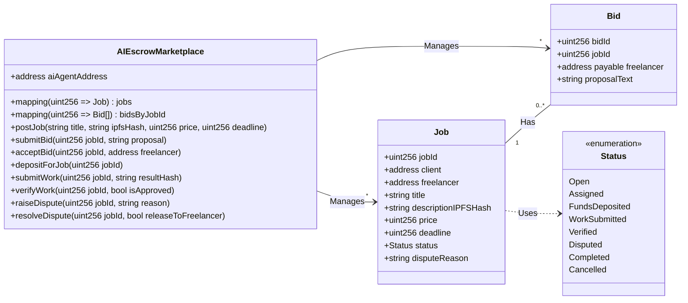
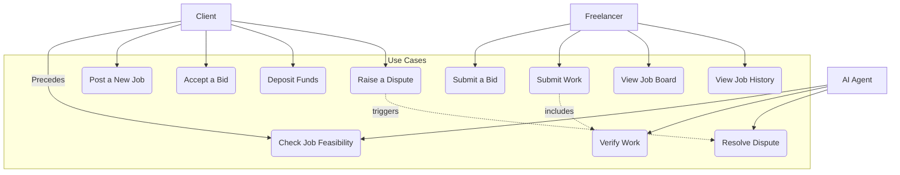
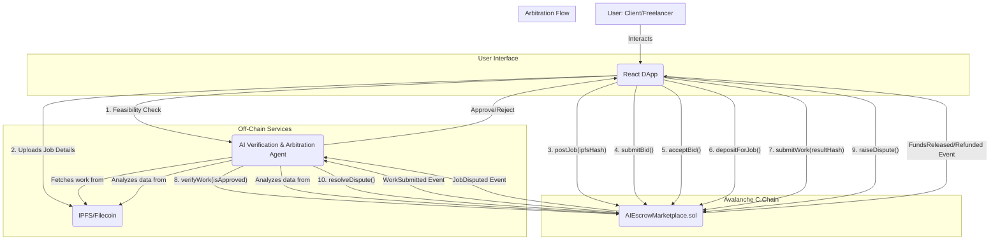
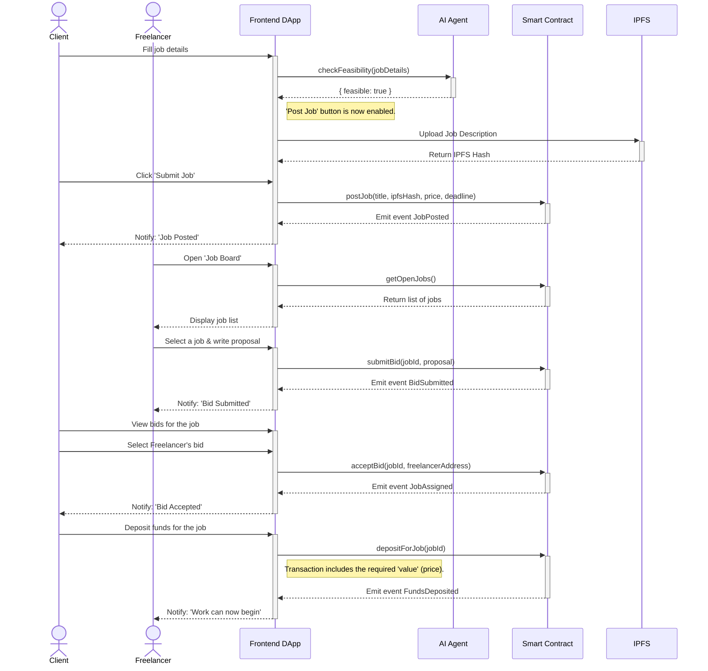
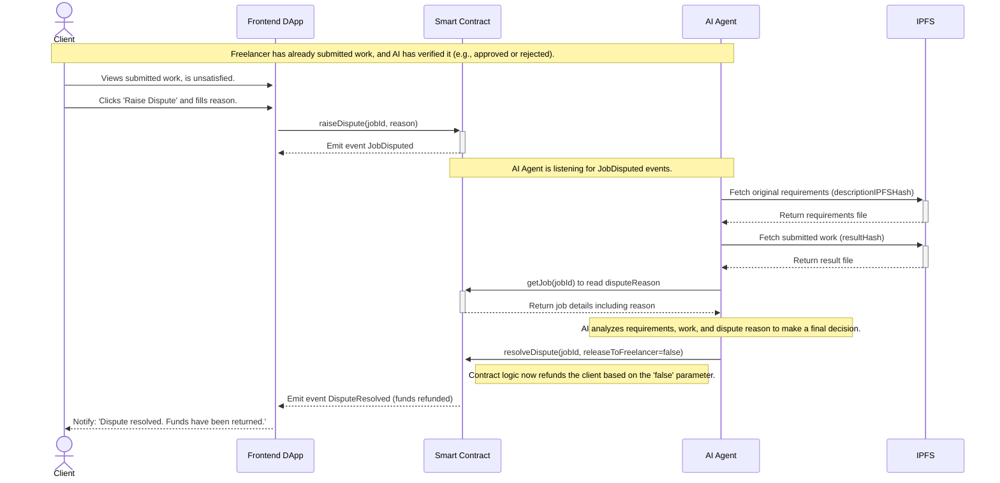

# Development Plan: AI Escrow Marketplace v2

## 1. Introduction

This document details the technical design for evolving the AI Escrow Marketplace prototype from a simple escrow mechanism into a functional freelance platform with a marketplace, bidding process, and separate dashboards for Clients and Freelancers.

## 2. Current State Analysis

- **Smart Contract:** Only supports a pre-arranged 1-to-1 workflow. Lacks functionality for public job postings or a bidding process. The `Job` data structure is minimal.
- **AI Agent:** Verification logic is still basic and not integrated with complex job details. It only acts after work is submitted.
- **Frontend:** Existing UI components are basic, reflecting the simple smart contract functions. There is no logical separation between the Client and Freelancer dashboards, and it lacks many of the required input fields and data displays.

## 3. Proposed Architecture & Changes

### 3.1. Smart Contract Changes (`AIEscrowMarketplace.sol`)

To support marketplace functionality, the data structures and workflow will be fundamentally changed.

**New Data Structures:**

```solidity
// Updated job statuses
enum Status {
    Open,           // Job posted, open for bidding
    Assigned,       // Freelancer selected, awaiting deposit
    FundsDeposited, // Client has deposited, work can begin
    WorkSubmitted,  // Freelancer has submitted the work
    Verified,       // AI Agent has completed verification
    Disputed,       // Client disputes the work/verification
    Completed,      // Funds have been released
    Cancelled       // Cancelled
}

struct Job {
    uint256 jobId;
    address payable client;
    address payable freelancer; // Filled after a bid is accepted
    string title;
    string descriptionIPFSHash; // Hash of detailed description, requirements, etc.
    uint256 price;
    uint256 deadline; // Unix timestamp
    Status status;
    string disputeReason; // Reason for dispute
}

struct Bid {
    uint256 bidId;
    uint256 jobId;
    address payable freelancer;
    string proposalText; // Freelancer's offer description
}

// New Mappings
mapping(uint256 => Job) public jobs;
mapping(uint256 => Bid[]) public bidsByJobId;
mapping(address => uint256[]) public jobsByFreelancer;
mapping(address => uint256[]) public jobsByClient;
```

**New Workflow & Functions:**

**Class Diagram:**



1.  `postJob(string memory _title, ...)`: Called by the **Client** to create a new job. This action is only enabled after an off-chain feasibility check by the AI Agent. Job status will be `Open`.
2.  `submitBid(uint256 _jobId, ...)`: Called by the **Freelancer** to place a bid on an `Open` job.
3.  `acceptBid(uint256 _jobId, ...)`: Called by the **Client** to select a winning bid. This sets `job.freelancer` and changes status to `Assigned`.
4.  `depositForJob(uint256 _jobId)`: Replaces `depositFunds`. The client deposits funds after a bid is accepted. Status changes to `FundsDeposited`.
5.  `submitWork`, `verifyWork`, and `_releaseFunds` functions will remain, with modifications.
6.  **`raiseDispute(uint256 _jobId, string memory _reason)`**: Called by the **Client** if they disagree with the submitted work, even after AI verification. This changes the status to `Disputed`.
7.  **`resolveDispute(uint256 _jobId, bool _releaseToFreelancer)`**: Called only by the **AI Agent** (or a future DAO) to finalize arbitration. It releases funds to the freelancer or returns them to the client.

### 3.2. AI Agent Changes

The role of the AI Agent is significantly expanded to act as a gatekeeper, verifier, and arbiter.

**Fase 1: Verifikasi Kelayakan Pekerjaan (Pre-Posting)**

Before a client can post a job to the smart contract, the frontend will first send the job details (title, description, requirements) to the AI Agent via an off-chain API call. The AI will perform a feasibility check based on:
- **Clarity & Completeness**: Are the requirements clear, specific, and measurable?
- **Feasibility**: Is the requested work technically possible within the given constraints?
- **Platform Policy**: Does the job violate any platform rules (e.g., illegal activities, spam)?
- **Scam Detection**: Does the job show signs of being a potential scam?

Only if the AI Agent returns a positive "feasibility score" will the frontend allow the client to proceed with the `postJob` transaction. This prevents gas wastage on poorly defined or malicious jobs.

**Fase 2: Verifikasi Hasil Pekerjaan & Arbitrase (Post-Submission)**

1.  **Verification**: This process remains the same. The agent listens for the `WorkSubmitted` event, fetches the job requirements and the submitted work from IPFS, and runs its verification logic. It then calls `verifyWork(jobId, isApproved)`.

2.  **Arbitration (Jika Terjadi Konflik)**: If a client is unsatisfied with the work and initiates a dispute by calling `raiseDispute`, the following occurs:
    - The smart contract status changes to `Disputed`.
    - The AI Agent is notified (e.g., by listening to a `JobDisputed` event or via an off-chain API call).
    - The AI Agent acts as an **impartial arbiter**. It analyzes:
        - The original job requirements (`descriptionIPFSHash`).
        - The freelancer's submitted work (`resultHash`).
        - The client's reason for the dispute (`disputeReason`).
    - Based on this three-way analysis, the AI determines the outcome (e.g., work is satisfactory, work needs revision, work is unsatisfactory).
    - The AI Agent then calls `resolveDispute(jobId, releaseToFreelancer)` on the smart contract to execute the final decision, either releasing the funds to the freelancer or refunding the client.

### 3.2.3. Pertimbangan untuk Integrasi/Adopsi Konsep Kite AI

Meskipun saat ini AI Agent diimplementasikan sebagai layanan off-chain, konsep-konsep yang diusung oleh platform Kite AI dapat memberikan panduan berharga untuk evolusi dan peningkatan di masa depan:

*   **Identitas dan Otentikasi AI Agent:** Mengadopsi model identitas kriptografi dari Kite AI dapat memungkinkan setiap AI Agent (atau modul dalam agent kita) memiliki identitas yang dapat diverifikasi secara on-chain. Ini akan meningkatkan transparansi dan auditabilitas semua keputusan yang dibuat oleh AI Agent, terutama dalam fase verifikasi kelayakan pekerjaan dan arbitrase.

*   **Tata Kelola Keputusan:** Prinsip tata kelola yang terperinci dari Kite AI dapat diterapkan untuk mendefinisikan dan menegakkan aturan tentang bagaimana AI Agent membuat keputusan verifikasi dan arbitrase. Ini bisa berupa seperangkat aturan yang dapat diprogram yang mengatur parameter, batasan, dan kriteria yang digunakan oleh AI Agent.

*   **Verifikasi Hasil yang Lebih Kuat:** Dengan kerangka kerja verifikasi Kite AI, kami dapat mempertimbangkan cara untuk secara kriptografis membuktikan integritas dan asal-usul hasil verifikasi AI Agent. Ini akan membangun kepercayaan yang lebih besar pada keputusan AI Agent, mengurangi potensi sengketa lebih lanjut.

*   **Perencanaan Berorientasi Agen (AOP):** Mengadopsi pendekatan AOP yang didukung oleh Kite AI dapat membantu dalam merancang AI Agent yang lebih modular, otonom, dan mampu berkolaborasi secara efektif. Ini akan sangat relevan jika di masa depan kita memiliki banyak AI Agent yang menangani berbagai aspek marketplace (misalnya, satu untuk verifikasi kelayakan, satu untuk verifikasi hasil, satu untuk arbitrase, dll.).

Integrasi langsung dengan blockchain Layer 1 Kite AI mungkin menjadi langkah evolusi di masa depan. Namun, mengadopsi filosofi desain dan fungsionalitas intinya dapat memperkuat kepercayaan, transparansi, dan kapabilitas AI Agent kita secara signifikan.

### 3.3. Frontend Design (React)

The dashboard will be logically separated after the user connects their wallet. The application will detect the user's role.

**New Components:**

- **Core Components:**
    - `ConnectWalletButton.tsx`: A button to connect a wallet.
    - `RoleBasedDashboard.tsx`: Renders either the Client or Freelancer dashboard.

- **Client-Side Components:**
    - `JobPostingForm.tsx`: Form for `postJob`. The "Submit" button is disabled until the AI feasibility check passes.
    - `MyPostedJobs.tsx`: List of client's jobs, showing status and bid counts.
    - `ViewBids.tsx`: View all bids for a job, with an `Accept Bid` button.
    - `DisputeForm.tsx`: A new modal form for a client to submit a `raiseDispute` call if they are unsatisfied.

- **Freelancer-Side Components:**
    - `JobBoard.tsx`: List of all `Open` jobs with search/filter.
    - `JobDetailModal.tsx`: Shows job details and the `submitBid` form.
    - `MyBidsList.tsx`: List of freelancer's submitted bids.
    - `ActiveJobs.tsx`: List of jobs the freelancer is working on.
    - `JobHistory.tsx`: Archive of completed jobs.

**State Management:**
- **Zustand** or **React Context** is recommended for managing global state.

## 4. UML Diagrams

### 4.1. Use Case Diagram



### 4.2. System Architecture Diagram (Updated)



### 4.3. Sequence Diagram: Job Posting to Work Start Workflow



### 4.4. Sequence Diagram: Arbitration Workflow

This new diagram shows the process when a client disputes the submitted work.



## 5. Technology & Integration
- **Frontend:** React (fully responsive Web app), Vite, Ethers.js (or Viem) for blockchain interaction.
- **Styling:** **Material-UI (MUI)** for building a professional and consistent dashboard theme.
- **Off-chain Storage:** IPFS (via `web3.storage` or Pinata) for storing job description files and work results.
- **AI Agent:** Python (FastAPI) server that communicates with the blockchain and IPFS.